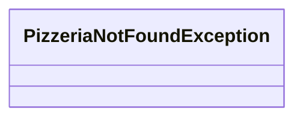

# PizzeriaNotFoundException

- Tipo: `class`
- Package: `com.pizzeria.pizzeriaservice.exception`
- Percorso sorgente: `backend/pizzeria-service/src/main/java/com/pizzeria/pizzeriaservice/exception/PizzeriaNotFoundException.java`
- Annotazioni: 
- `@ResponseStatus`

## Diagramma

## Metodi
- Nessun metodo pubblico rilevato.

---
_Documento generato automaticamente. Modifica la classe sorgente o aggiorna lo script per personalizzare il contenuto._
