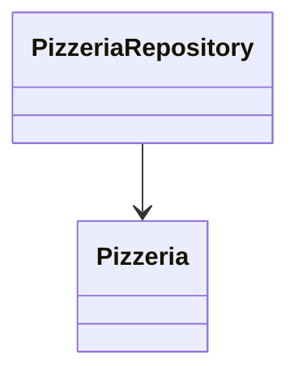

# PizzeriaRepository

- Tipo: `interface`
- Package: `com.pizzeria.pizzeriaservice.repository`
- Percorso sorgente: `backend/pizzeria-service/src/main/java/com/pizzeria/pizzeriaservice/repository/PizzeriaRepository.java`
- Annotazioni: 
- `@Repository`

## Diagramma

## Metodi
- Nessun metodo pubblico rilevato.

---
_Documento generato automaticamente. Modifica la classe sorgente o aggiorna lo script per personalizzare il contenuto._
