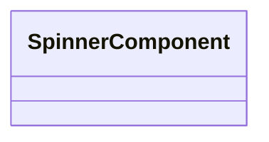

# SpinnerComponent

- Tipo: `class`
- Percorso sorgente: `frontend/pizzeria-app/src/app/ui/spinner/spinner.component.ts`
- Feature: `ui`
- Decorator: 
- `@Component`

## Diagramma

## Metodi
- Nessun metodo pubblico rilevato.

---
_Documento generato automaticamente. Modifica il file sorgente o lo script per personalizzare il contenuto._
