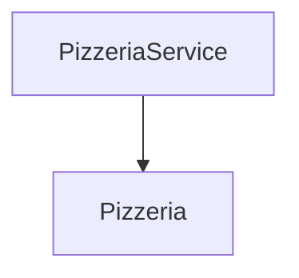

# Feature `pizzerias`

- Percorso sorgente: `frontend/pizzeria-app/src/app/pizzerias`
- Entità incluse:
- [Pizzeria](../entities/Pizzeria.md)
- [PizzeriaService](../entities/PizzeriaService.md)

## Relazioni interne

---
_Documento generato automaticamente. Modifica i file della feature o aggiorna lo script per personalizzare il contenuto._
