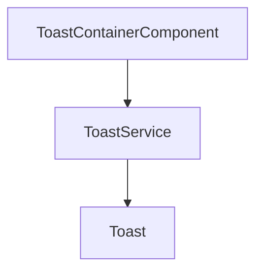

# Feature `ui`

- Percorso sorgente: `frontend/pizzeria-app/src/app/ui`
- Entità incluse:
- [SpinnerComponent](../entities/SpinnerComponent.md)
- [Toast](../entities/Toast.md)
- [ToastContainerComponent](../entities/ToastContainerComponent.md)
- [ToastService](../entities/ToastService.md)

## Relazioni interne

---
_Documento generato automaticamente. Modifica i file della feature o aggiorna lo script per personalizzare il contenuto._
